# Hugging Face LLMs Apps

Notebooks and materials for working with large language models (LLMs), RAG, attention/BERT, pre-training & fine-tuning, and streaming networks — using Hugging Face and LlamaIndex.

---

## Notebooks

| Notebook | Description |
|----------|-------------|
| **ask questions about research papers to LLMs.ipynb** | Ask questions about research papers using LLMs: load PDFs with LlamaIndex, embed with Hugging Face, and run a RAG-style Q&A pipeline. |
| **explore_attention_is_all_you_need_BERT.ipynb** | Explore *Attention Is All You Need* and BERT with embeddings and retrieval over PDFs. |
| **explore_research_papers_about_STNets.ipynb** | Explore research papers on Streaming Networks (STNets) using the same RAG setup. |
| **Pre-training and Fine-tuning.ipynb** | MLP pre-training with RBMs, fine-tuning, and transfer learning (including CNNs and VGG16). |

---

## Concepts & Figures

### Asking questions to LLMs (RAG)


### Attention & Transformers

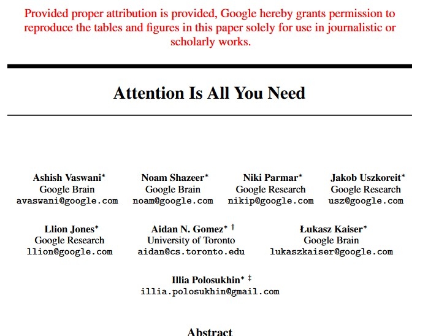

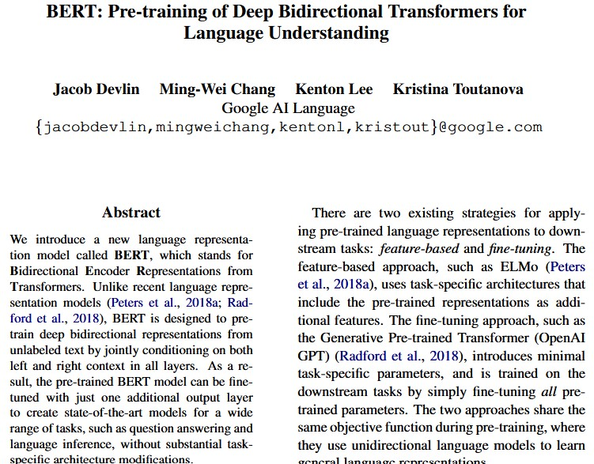

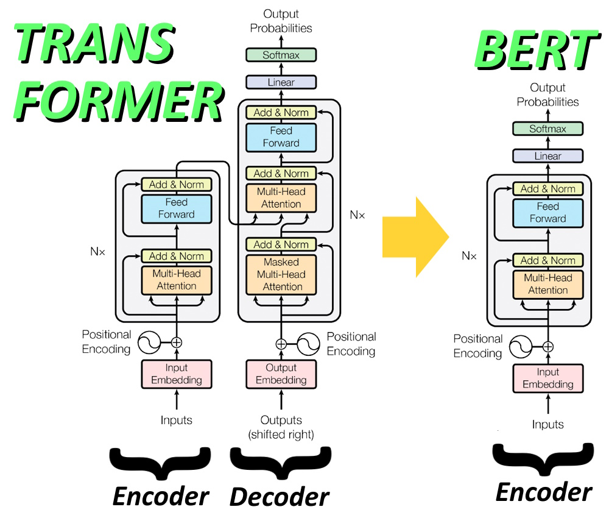

### Fine-tuning LLMs

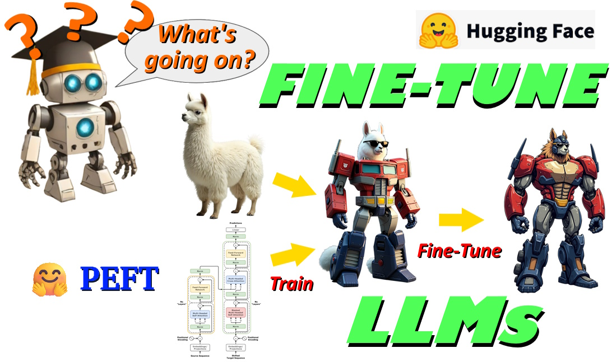

### LlamaIndex (RAG pipeline)

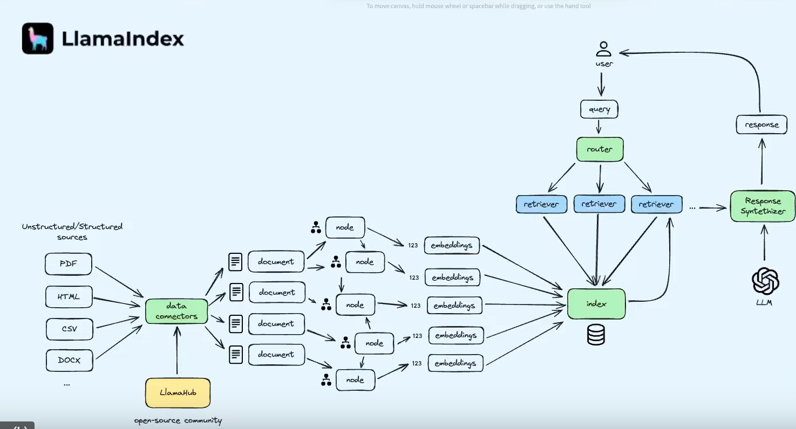

### Pre-training & fine-tuning (MLPs)

Research background (Larochelle et al., 2009):

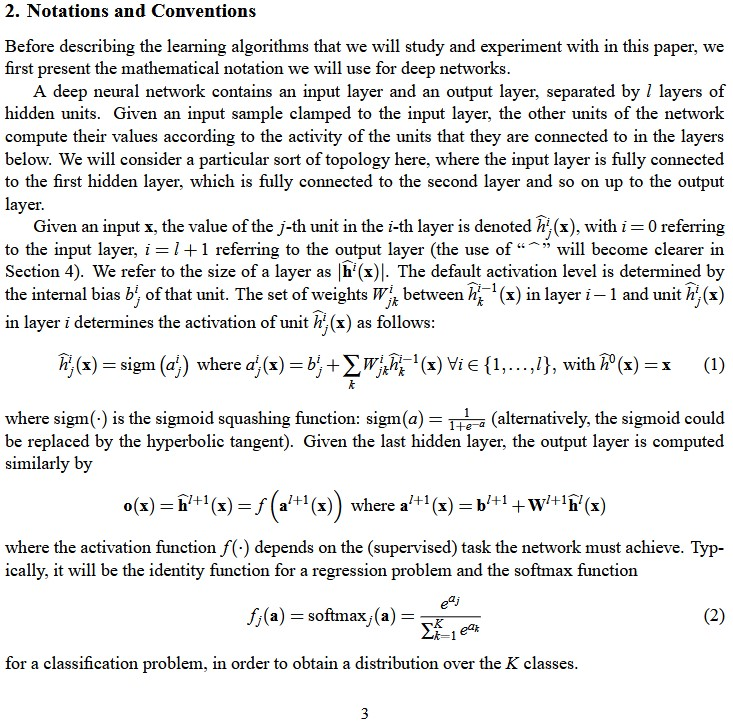  
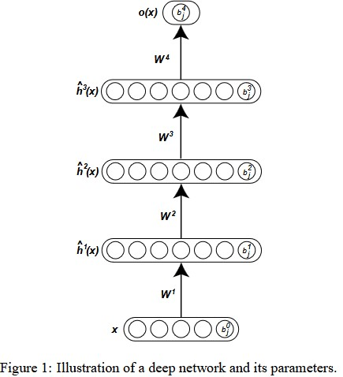

MLP structure and functionals:

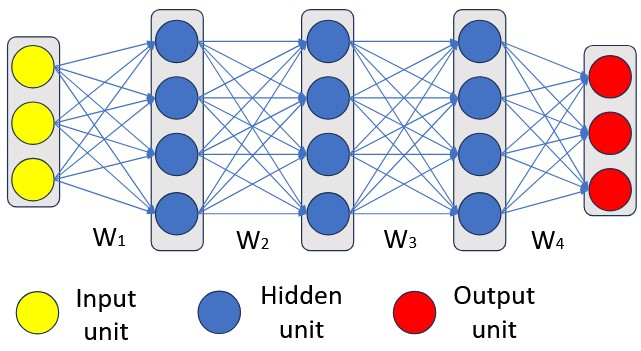

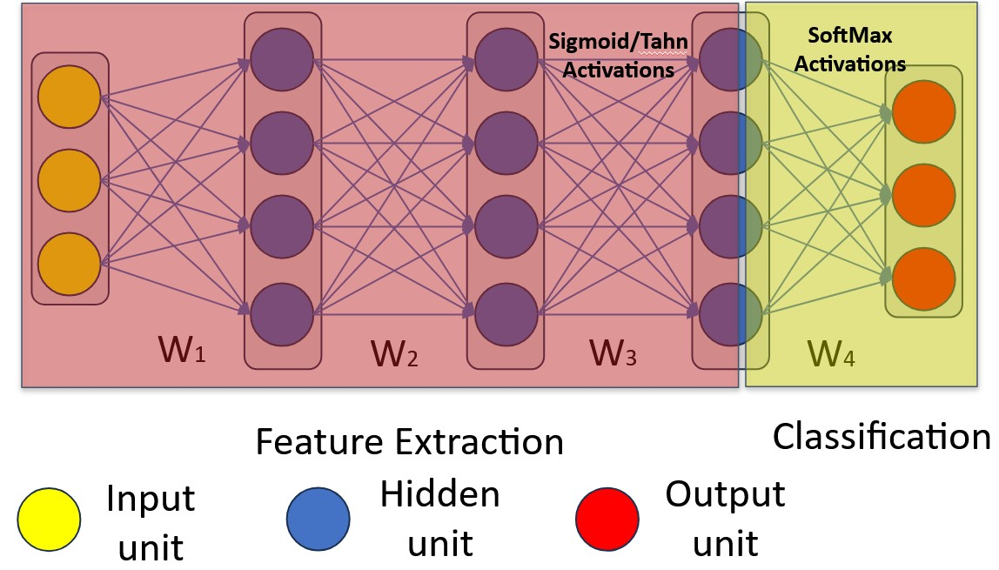

RBM and stacked RBMs:

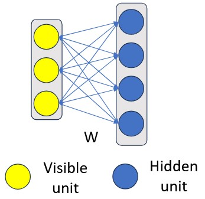

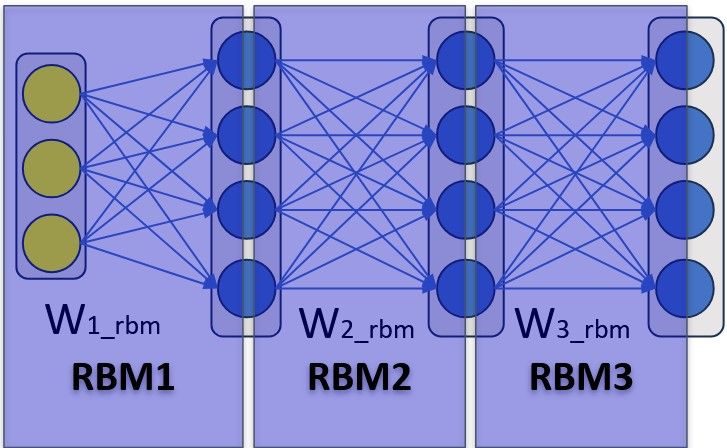

Pre-training and fine-tuning MLPs:

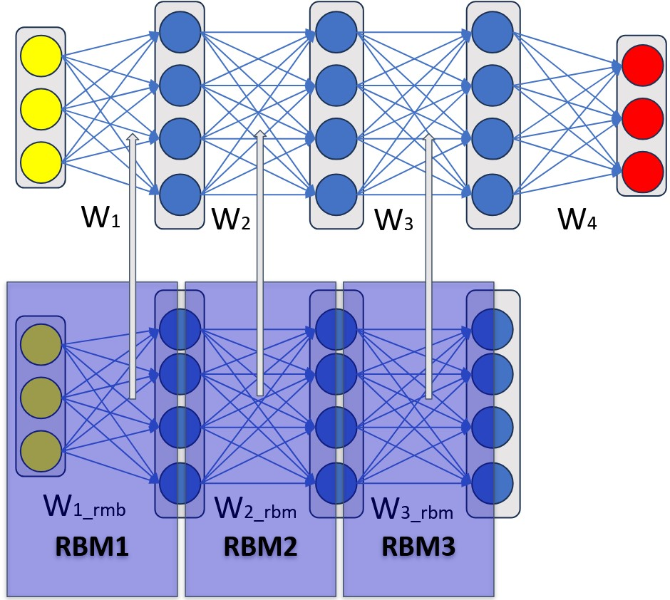

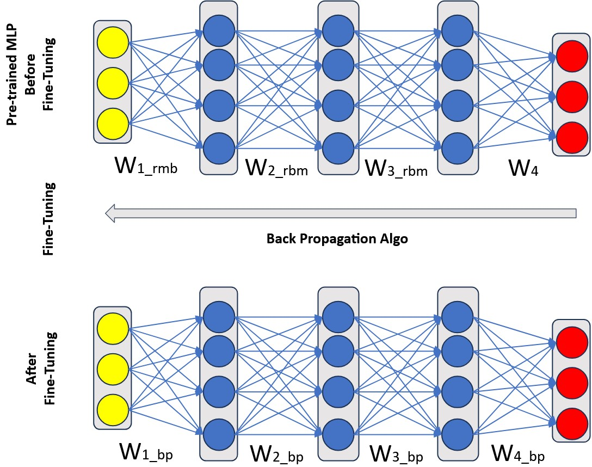

### Transfer learning

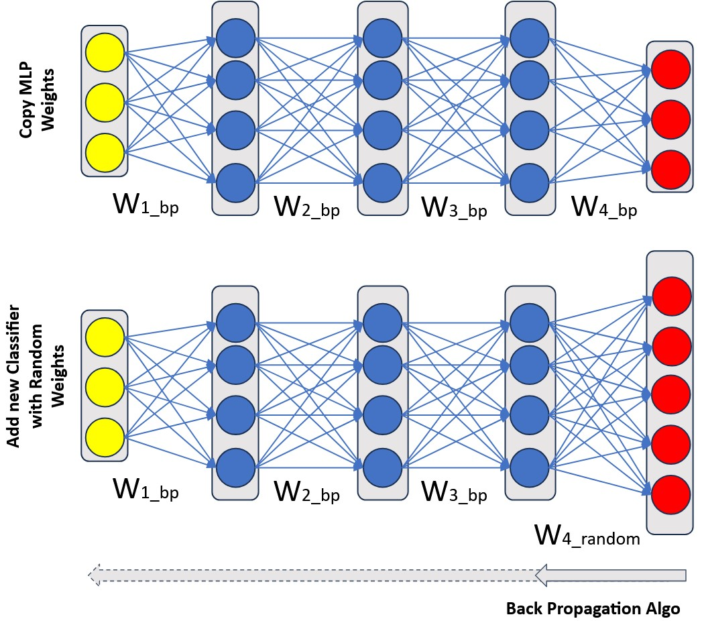

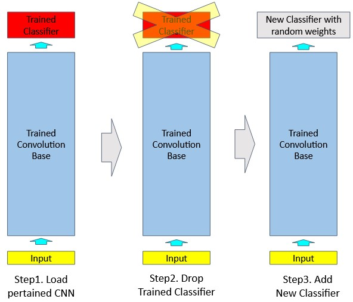

### VGG16

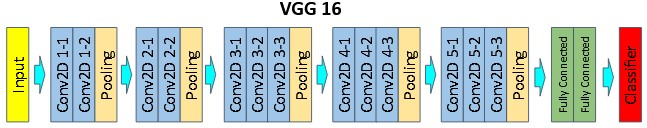

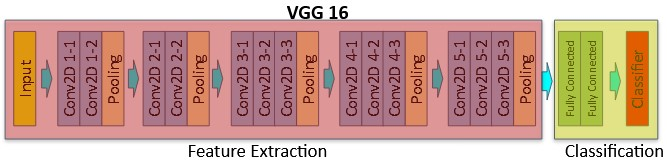

---

## Repository structure

```
├── ask questions about research papers to LLMs.ipynb
├── ask_questions_about_research_papers to LLMs.ipynb
├── explore_attention_is_all_you_need_BERT.ipynb
├── explore_research_papers_about_STNets.ipynb
├── Pre-training and Fine-tuning.ipynb
├── stnets/                    # Streaming Networks papers (PDFs)
├── *.jpg                      # Figures used in the notebooks
└── *.pdf                      # Reference slides and papers
```

---

## Requirements

- Python with Jupyter
- [LlamaIndex](https://www.llamaindex.ai/) (for RAG and PDF loading)
- [Hugging Face](https://huggingface.co/) (embeddings and models)

Install typical dependencies:

```bash
pip install llama-index llama-index-embeddings-huggingface
```

Place PDFs in the paths expected by each notebook (e.g. a `stnets/` or other directory) before running.

---

## License

See the repository license, if any. Papers and slides in this repo are subject to their respective authors’ terms.
